# Este repositorio corresponde ao trabalho feito para a JUCEMA enquanto estagiario. Este codigo foi escrito do zero e todas as funcionalidades estão de acordo com os requisitos dos superiores do setor.

  <h2>Este projeto utiliza:</h2>
  <ul>
    <li><a href="https://www.devmedia.com.br/guia/docker/40813">Containers com Docker</a></li>
    <li><a href="https://pt-br.reactjs.org/docs/context.html">Context API</a></li>
    <li><a href="https://react-redux.js.org/introduction/getting-started">React Redux</a></li>
    <li><a href="https://www.devmedia.com.br/react-js-criando-rotas-com-react-router-dom/42901">React Router</a></li>
  </ul>

<section>
 <h3>Docker:</h3>
 
Com alta usabilidade no mercado, foi adotada esta estratégia para conseguir servir a aplicação feita com react, uma vez que o docker facilita o deploy da aplicação e diminui drasticamente a necessidade de grande espaço para armazenamento no servidor da aplicação, além disso, também permite que dois ou mais containers consigam trabalhar juntos sem grandes problemas. Posso citar essa aplicação como exemplo, onde o front-end fica com um ip e a api fica com outro, porém ambos ficam na mesma rede do container, facilitando assim a cominicação front/backend e diminuindo o problema com as políticas de segurança do google( como o cors por exemplo ).

</section>
  
<section>
 <h3>Context API:</h3>
  
Essa funcionalidade já é nativa do react, não sendo necessário nada externo. Essa estratégia foi adotada pela necessidade de ter um estado global e acessivel em toda a aplicação, e nesse caso, o estado global trata-se dos filtros disponíveis para selecionar. Baseado no estado desses filtros, que inicialmente começam nulos, são feitas as requisições para a api, e a cada mudança no estado de cada filtro, uma nova requisição é feita passando os valores selecionados para a api, que por sua vez cria as querys para o banco e faz as requisições para o endpoint do banco de dados. 

  <h3>Redux:</h3>
  
O redux basicamente é o responsável por prover o estado global da aplicação e permitira muda-lo a partir de ações tomadas. Este envolve a aplicação por completa, ou seja, necessita estar no nivel mais alto da aplicação, pois somente assim pe possível acessar o estado global e mudar seu estado,

  <h3>React Router:</h3>
  
Esta aplicação possui apenas duas rotas, uma para empresas-abertas e outra para empresas-ativas, e essas rotas são criadas utilizando bibliotecas do proprio react, no entanto, se necessária a crialção de mais rotas também é possível, só dependendo dos requisitos da aplicação.

</section>

  <h2>Descrição do projeto</h2>
  

    Este projeto nasceu da necessidade de melhorar a experiencia do usuario e trazer funcionalidades até então não existentes, veja a comparação entre o projeto antigo e o atual logo abaixo:
  

  Atualização de dados:
   <ul>
     <li>ao sair uma atualização no banco de dados da empresa, para que isso refletisse nos dados do painel antigo, o processo era manual, onde um administrador do sistema deveria passar os dados de uma forma nada agradavel.</li>
     <li>com o painel novo, ao entrar no sistema, uma requisição é feita para a api que redireciona ao banco, por tanto, se o banco for atualizado não é necessária uma intervenção humana, pois a aplicação já atualizada todos os dados de forma automatica.</li>
   </ul>
  Verificação de dados:
  <ul>
     <li>no painel antigo, existiam todos os filtros até então utilizados, porém em cada filtro era possível selecionar somente uma opção, e isso foi um dos requisitos para que fosse melhorado no novo painel, onde fosse possível selecionar mais de uma opção por filtro, para que facilitasse a retirada de informações mais complexas.</li>
    <li>no novo painel, esse requisito foi atendido, e agora é possível selecionar mais de uma opção por filtro</li>
  </ul>
  Download de dados en png e csv:
  <ul>
     <li>no painel antigo, era somente possível verificar as informações, e foi solicitado que adicionasse as opções de download em imagem e csv</li>
    <li>no novo painel esses requisitos foram atendidos, implementando assim mais uma funcionalidade até então não existente, isso facilitou o trabalho das pessoas que necessitam dessas informações, pois antes tinham que tirar print da tela e manipular a imagem, e agora conseguem ter essa imagem apenas clicando em um botao.</li>
  </ul>
  Visual do projeto:
  <ul>
    <li>o projeto antigo não se adaptava a resoluções de telas diferentes, e com a diversidade de dispositivos hoje existente, nada mais justo que adicionar essa nova funcionalidade no projeto.</li>
    <li>no novo painel isso foi implementado, e hoje a aplicação se adapta a celular, tablet, notbook e computador, e também foi criado um visual novo totalmente do zero para este projeto, onde mudei totalmente o layout do painel antigo trazendo um visual mais agradavel e intuitivo.</li>
  </ul>
  <h2>Veja a seguir algumas imagens do projeto documentado no storybook</h2>
  

    <section>
      
Component e Template de gráficos

      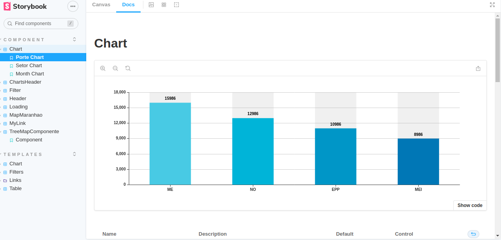
      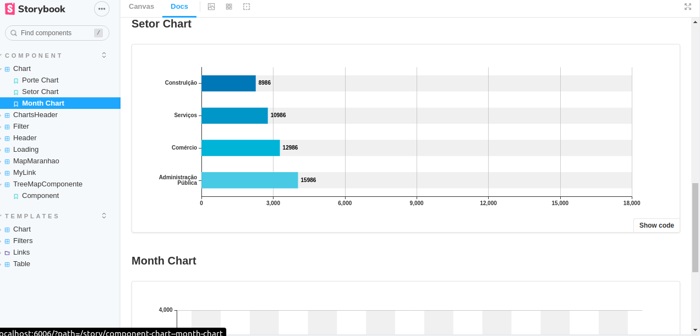
      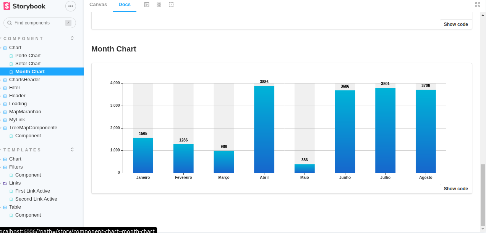
      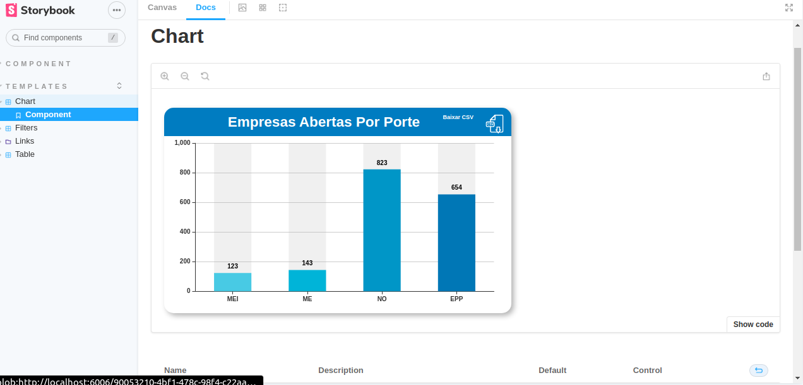
    </section>
    <section>
      
Component e Template de filtros

      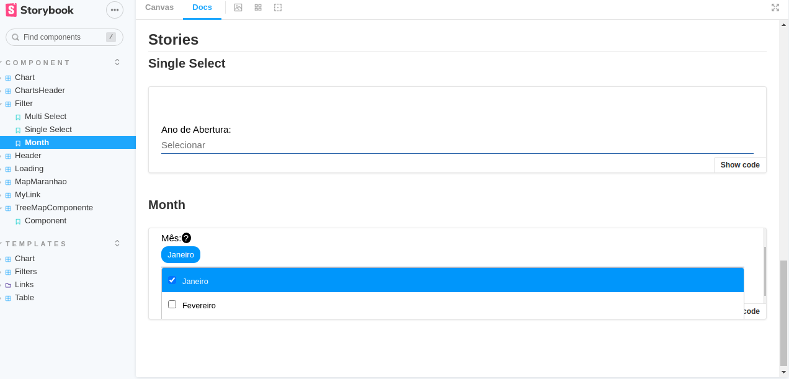
      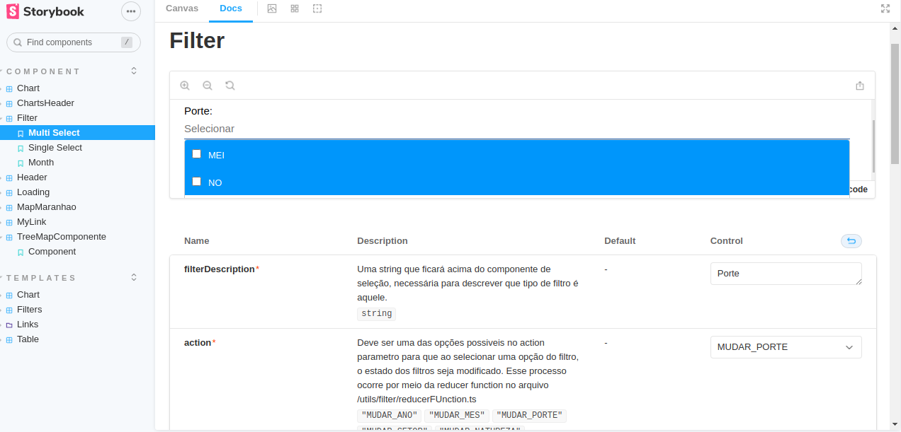
      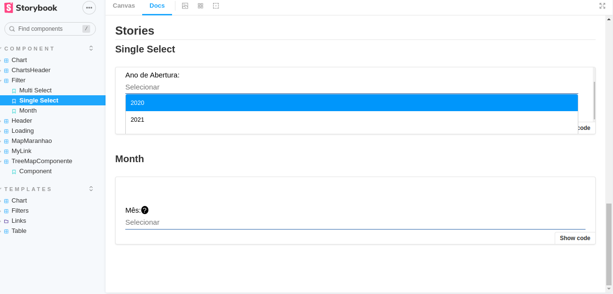
      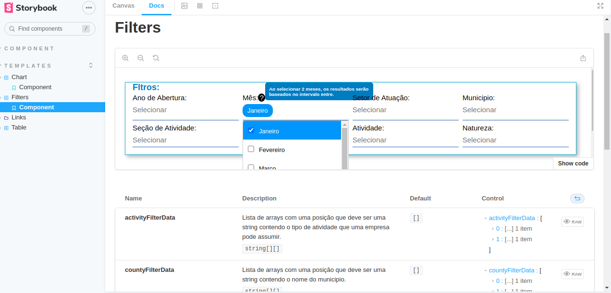
    </section>
    <section>
      
Template dos links

      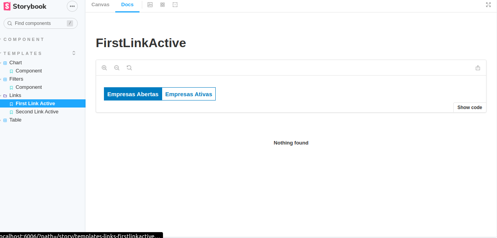
    </section>
    <section>
      
Template do Mapa

      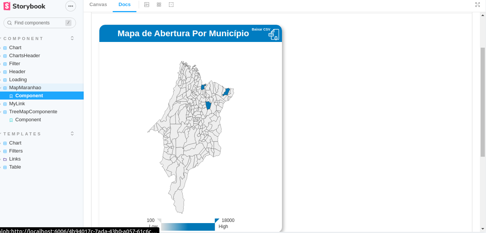
    </section>
    <section>
      
Template do treemap 

      Template do treemap 

.png' />
    </section>
    <section>
      
Template das tablas

      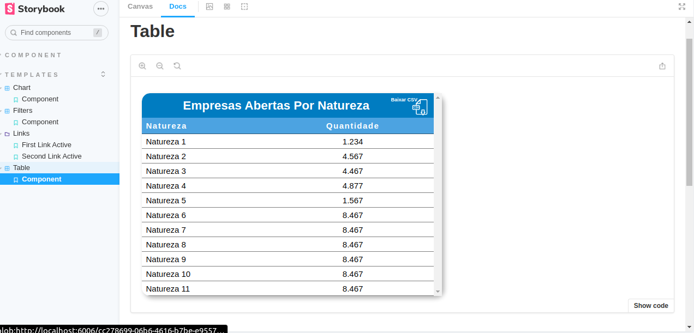
    </section>
  

